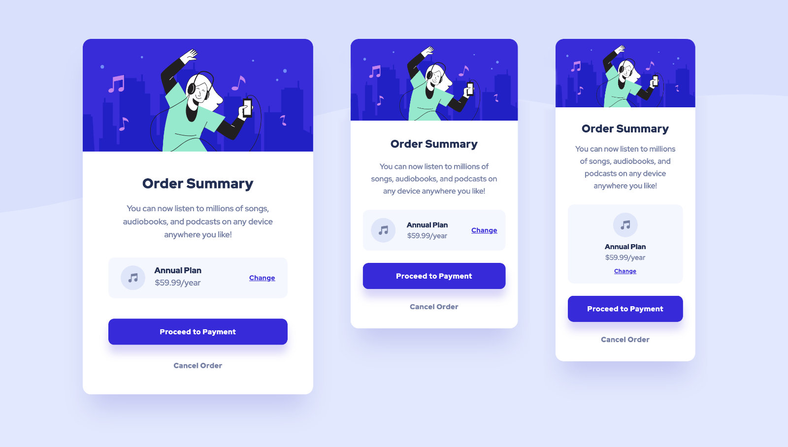
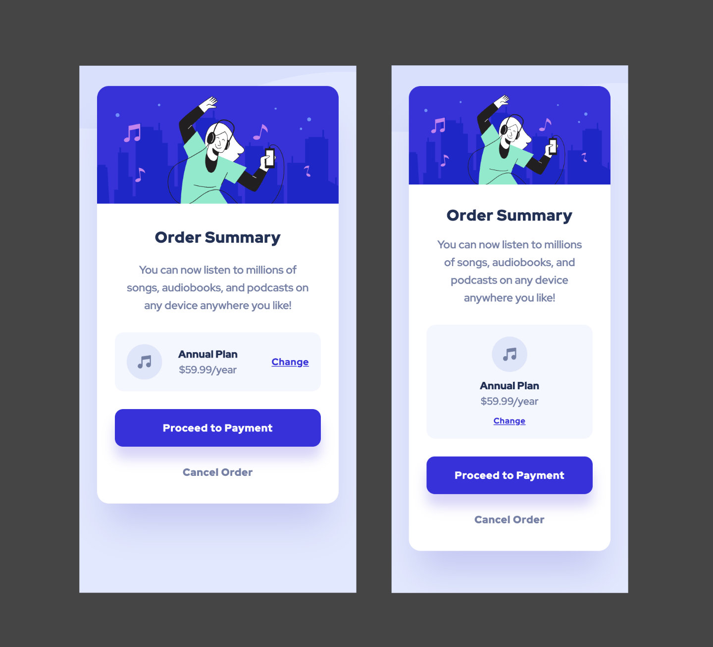

# Frontend Mentor - Order summary card solution

This is a solution to the [Order summary card challenge on Frontend Mentor](https://www.frontendmentor.io/challenges/order-summary-component-QlPmajDUj). Frontend Mentor challenges help you improve your coding skills by building realistic projects. 

## Table of contents

- [Frontend Mentor - Order summary card solution](#frontend-mentor---order-summary-card-solution)
  - [Table of contents](#table-of-contents)
  - [Overview](#overview)
    - [The challenge](#the-challenge)
    - [Screenshots](#screenshots)
    - [Links](#links)
  - [My process](#my-process)
    - [Built with](#built-with)
    - [What I learned](#what-i-learned)
    - [Continued development](#continued-development)
    - [Useful resources](#useful-resources)
  - [Author](#author)
  - [Acknowledgments](#acknowledgments)

**Note: Delete this note and update the table of contents based on what sections you keep.**

## Overview

### The challenge

Users should be able to:

- See hover states for interactive elements

### Screenshots

Desktop


Mobile



### Links

- Solution URL: [Solution code on Github](https://github.com/mindful108/frontendmentor-product-preview-card-component.git)
- Live Site URL: [Live solution hosted on Github](https://mindful108.github.io/frontendmentor-product-preview-card-component/)

## My process

### Built with

- Semantic HTML5 markup
- CSS with custom properties (variables)
- Flexbox
- Mobile-first workflow
- ADD...

### What I learned

Share...

Here is the code I used in my solution.

```html
<h1>Hello</h1>
```


```css
body {
  color: red;
} 
```


### Continued development

I plan to do more Frontend Mentor projects to continue developing my speed and workflow using my own custom snippets and starter templates. I will also start to use Tailwind CSS and looking forward to incorporating React for more interactive challenges.

### Useful resources

[I used this MDN doc](https://developer.mozilla.org) as needed...

 
## Author

- Website - [Judah Lynn](https://judahlynn.com)
- Frontend Mentor - [@mindful108](https://www.frontendmentor.io/profile/mindful108)


## Acknowledgments

ADD...